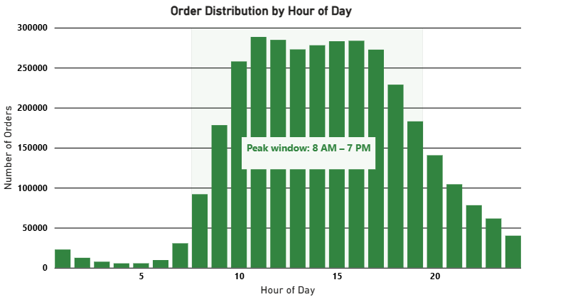
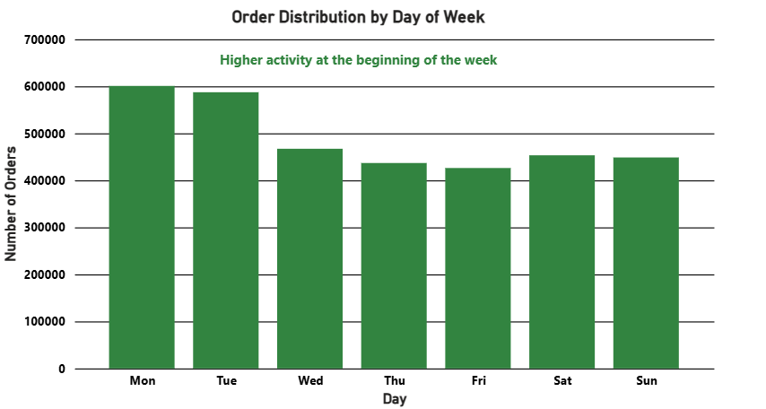

# Instacart Customer Reorder and Basket Analysis

## Overview
This project analyzes customer ordering behavior, category performance, reorder patterns, and basket structure using Instacart transactional data.

## Business Questions
- When do customers place orders?
- Which categories are the most purchased?
- Which categories have the highest reorder rates?
- Which aisle pairs are most frequently purchased together?

## Dataset
- Source: Instacart Market Basket Analysis
- Main tables used: `orders`, `order_products_prior`, `products`, `aisles`, `departments`
- Analysis is mainly based on `prior` orders

## Tools
- SQLite
- SQL
- Python
- Pandas
- Matplotlib

## Analysis Sections
- Customer Ordering Behavior
- Product and Category Performance
- Reorder Analysis
- Basket Analysis

## Key Findings
- Orders are concentrated during daytime, especially from 8:00 to 19:00.
- Most baskets contain a small to moderate number of products.
- Produce, dairy, and beverages are among the most important categories.
- High reorder rates are concentrated in replenishment-driven categories such as milk, eggs, yogurt, and fresh fruits.
- Co-purchase results show strong household replenishment and healthy-eating shopping patterns.

## Business Recommendations
- Use replenishment reminders for high-reorder categories.
- Create bundle recommendations for frequently co-purchased aisle pairs.
- Leverage fresh produce as a gateway category for cross-selling.

## Selected Visuals

### Order Distribution by Hour of Day

### Order Distribution by Day of Week

### Basket Size Distribution

